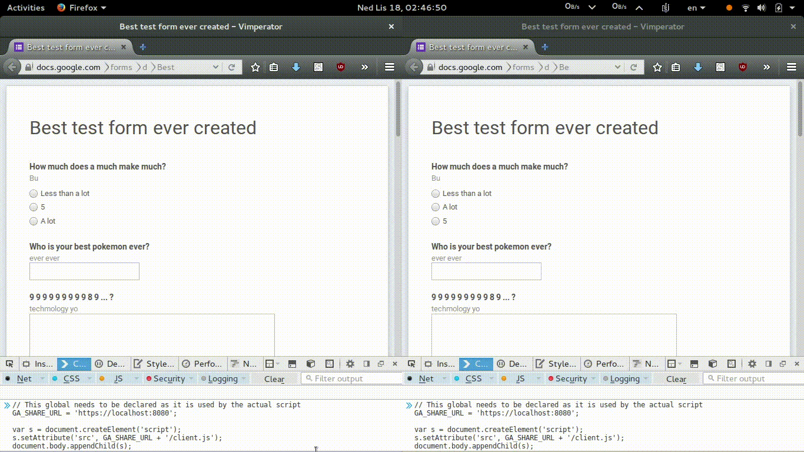

# multiform

This is a small utility that allows multiple clients to work on the same HTML form with realtime updates.

## Usage

### Server

The server requires an HTTPS key and certificate present in the files `server.key` and `server.crt`.

Install the dependencies with `npm install`.

Run the server with `node app.js`

### Client

Simply paste the Javascript snippet from client-connect.js into your favorite browser. Remember to update the server URL if you are not serving this from localhost.

## License

This project is released under the GPLv3 license. The terms of the license are available in the file `LICENSE`.
